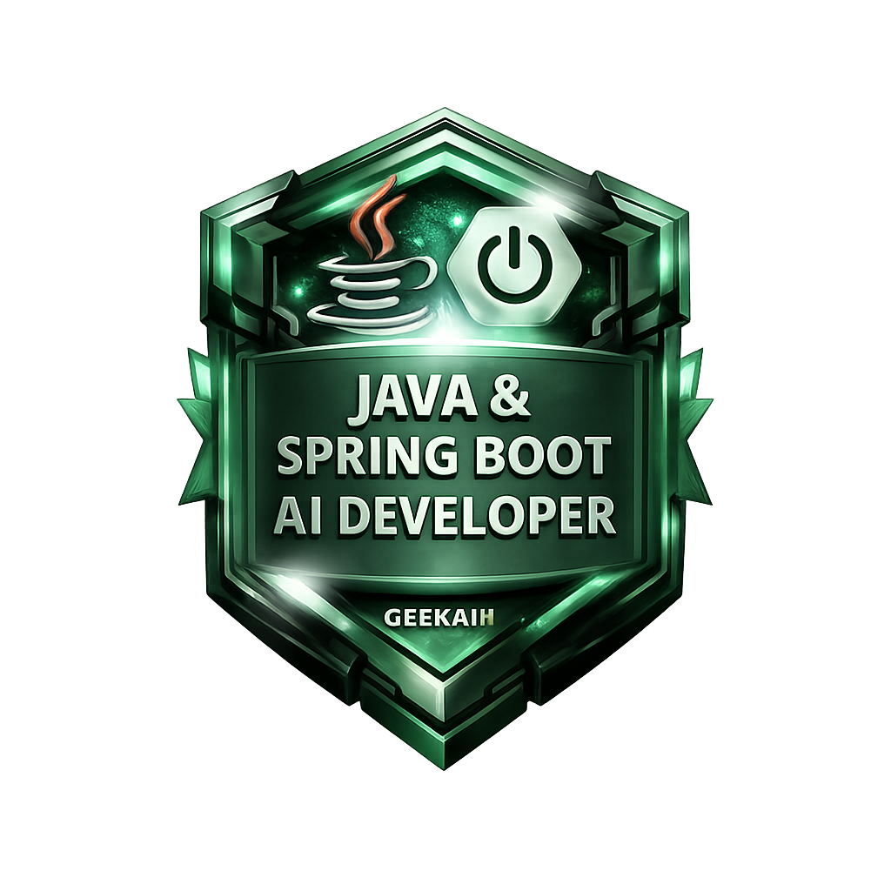

# 🤖 My first Java developer copilots
Sistema de copilotos para acelerar aprendizado e desenvolvimento backend em Java (Spring Boot), cobrindo diagnóstico, planejamento, implementação e estudo.

| Modo  | Função                  |
|-------|--------------------------|
| ASK   | Entender problema        |
| PLAN  | Estruturar solução       |
| AGENT | Implementar              |
| STUDY | Aprender profundamente   |

<h2 align="center">
Bootcamp Globant - Java & Spring Boot AI Developer
</h2>

  

